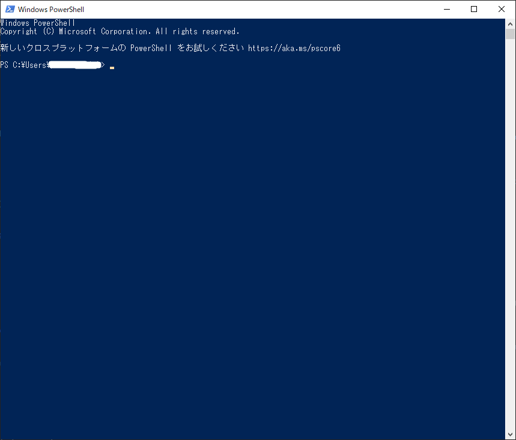
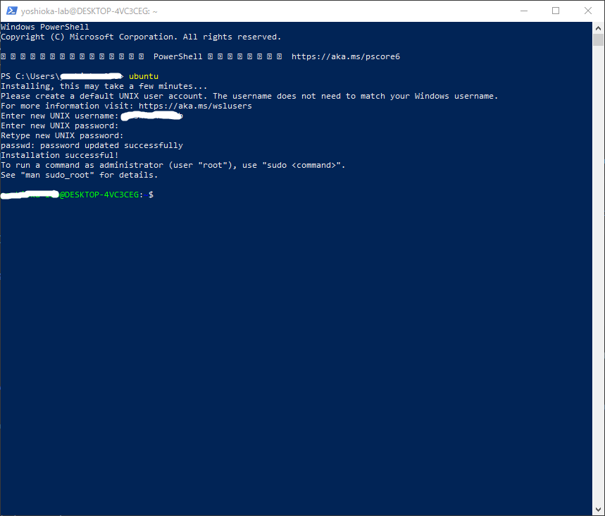
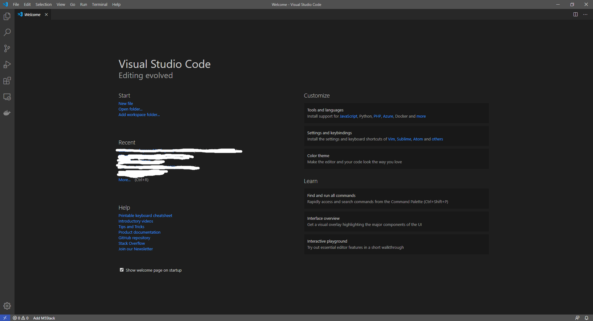
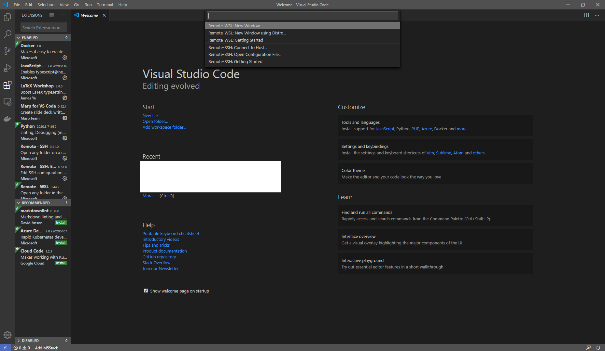
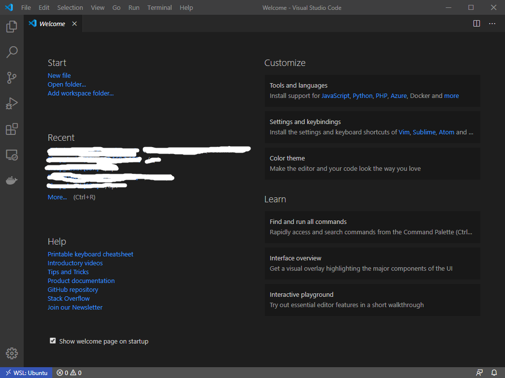
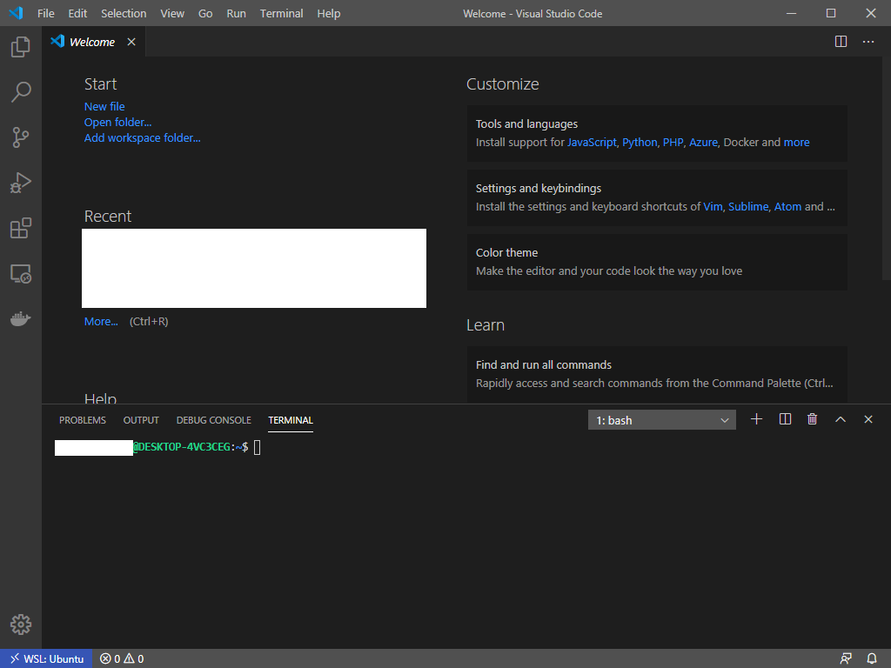

# C言語入門
ようこそ，C言語入門へ．  
ここでは，**世界で一番書かれている言語**でもある，C言語の基礎を学んでもらおうと思う．
C言語を学べばおおよそのプログラミング言語は書けるようになるだろう．
それほどC言語はメジャーで，参考にされてきた言語なのである．  
ちなみに，この環境構築はWindows10向けである．他のWindowsバージョンを使っている人は注意してほしい．  
macだのLinuxだのを使える人間にはこんな記事は不要だろうが，わからなくても適宜google検索などで調べて頑張ってくれ． 

## C言語開発環境
さて，早速C言語を学んでもらいたいところではあるが，そのためには準備が必要である．  
そう，環境構築である．開発環境を計算機の上に作らなればどんな言語もプログラミングできない．  
というわけで，C言語の開発環境を整えてほしい．

### **Windows Subsystem for Linux (WSL)** のインストール
最近のWindowsでは簡単にLinuxをエミュレートできるようになっている．  
今回はこちらを用いて環境構築を行っていく．
まず，WSLが利用できるように設定を変更しなければならないので，これから説明していこう．

1. windowsメニューから設定を開く  
  
↑ このwindowsロゴのボタンを押すとメニューが開く．  
  
このメニューの歯車ボタンをクリックすると，  
   
このウィンドウが表示される．
これがWindows10標準の設定画面なので覚えておくと良いだろう．  
2. Windowsの機能の有効化または無効化の画面を開く  
先程の設定画面で**アプリ**を選び，下にスクロールすると，関連設定に**プログラムと機能**とある．  
  
これをクリックすると，↓のような画面が出る．  
  
左のメニューに表示されている**Windowsの機能の有効化または無効化**をクリックする．

3. WSLの有効化  
  
Windowsの機能 というウィンドウが表示されたら**Windows Subsystem for Linux**の項目を探して，  
  
チェックを入れて**OK**をクリックする．  
  
しばらく待って，  
  
この画面が出ればOK．再起動しよう．

4. WSLのインストール
WSLにはいくつかの種類がある．今回はubuntuを使おう．  
タスクバーの検索ボタンからstoreと検索すると，**Microsoft Store**が表示されるのでこちらを起動する．  
  
  
ここで，検索から**ubuntu**と検索する．  
  
一番目に出てくる**ubuntu**をクリックすると詳細ページに移動するので，**入手**をクリックしてインストールする．


5. WSLの起動  
ここで，タスクバーのWindowsボタンの上で右クリックして，**WindowsPowerSell**を起動する．  
  
ここで**ubuntu**と入力してエンターキーを押すとユーザー名とパスワードを聞かれるので設定する．  
  
これでWSLのインストール完了である．なお，以下のコマンドを実行しておくことが望ましい(少々時間がかかるので気長に待つこと)
```bash:update
$ sudo apt update -y && sudo apt upgrade -y
```

### **Visual Studio Code**のインストール
**Visual Studio Code**(VSCode)とは，マルチプラットフォームのエディタで，近年非常に人気が高い．
優秀なコード補完機能，豊富な拡張機能があり，使い勝手が非常に良い．  
今回はWSL用の拡張機能を利用するためこちらを使用する．  
1. インストーラのダウンロード  
[こちら](https://code.visualstudio.com/download)の公式サイトからWindows用のものをダウンロードする．
2. インストール  
ダウンロードしたインストーラを起動して，画面の指示に従ってインストールする．  
基本的に**キャンセル**じゃない方をクリックしていけば良い．  
  
  
  
  
  
ここまでくればインストール完了だ．  
このまま完了をクリックすると↓のようなウィンドウが表示されるはずだ．

3. 拡張機能のインストール
このままWSL用の拡張機能をインストールしていこう．  
左のアイコンから四角がたくさんあるところをクリックすると検索窓が出てくる．  
  
一番上の*Search* *Extensions* *in...* となっているところに**WSL**と入力する．  
検索すると，一番上に**Remote-WSL**が出てくるのでこれをインストールする．  
  
左下の **><** みたいなところをクリックすると，ウィンドウ上部に入力窓が表示される．  
  
1番上を選択したままエンターキーを押すと，アクセス許可のウィンドウが表示されるので許可すると，WSL内に接続したVSCodeのウィンドウが現れる．  
  

### コンパイラのインストール
ではC言語を書く上で欠かせないコンパイラをインストールしていく．
ウィンドウ上部のメニューから**Tarminal**→**NewTerminal**を選択してターミナルを起動してほしい．  
  
ここで，以下のコマンドを入力してエンターキーを押すとコンパイラである **gcc** のインストールが始まる．  
```bash:install_gcc
$ sudo apt install gcc
```
パスワードを聞かれたら先程設定したパスワードを，[Y/n]の記述が出たらYを入力してエンターキーを押す．  
  
暫く待つとターミナルが戻ってくるので，↓のコマンドを入力してインストールできているか確認する．  
```bash:varsion_of_gcc
$ gcc -v
```
↓のような表示が出ればok  
  

## まとめ
以上でwin10上でのC言語開発環境の構築は終了である．  
これ以外にもC言語の開発環境を整える方法はたくさんあるので，気になる人は調べてみてほしい．  
では次回，Hello World!で．